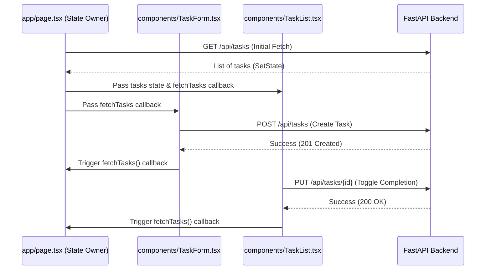

# 🌐 EVO-TODO: Frontend Developer Guide (Next.js)

Welcome to the **EVO-TODO Frontend** documentation. This client is a modern, responsive, and visually stunning web application built on **Next.js 15 (App Router)**, **TypeScript**, **Tailwind CSS**, and **Framer Motion** for state-of-the-art cinematic transitions and micro-animations.

---

## 🎨 Design System & Visual Aesthetics

The UI implements a **premium dark-mode-first glassmorphic system** featuring:
1.  **Cinematic Ambient Backgrounds:** Floating, blurred HSL color accents (`bg-indigo-500/10`, `bg-blue-500/10`) with keyframe float cycles (`animate-float`).
2.  **Glassmorphism Layers:** Translucent panels (`glass` utility) utilizing backdrop-blur filters for depth.
3.  **Modern Typography:** Elegant italicized uppercase headings and high-contrast letter-spacing.
4.  **Micro-animations:** Interactive form focuses, smooth checkbox scales, list exit/entry transitions (`AnimatePresence` with custom spring presets).

---

## 📂 Frontend File Architecture

*   `app/`:
    *   `layout.tsx`: Sets up global viewport, html attributes, and links global styles.
    *   `page.tsx`: Primary parent view controller containing data-fetching loops (`fetchTasks`), state management hooks, loading indicator wrappers, and responsive layouts.
    *   `globals.css`: Core stylesheet declaring HSL styling tokens, variables, cinematic overlays, `@keyframes`, custom scrollbars, and tailwind extensions.
*   `components/`:
    *   `TaskForm.tsx`: Interactive form block for creating tasks (inputs for title, description, priority select, tags). Communicates with backend endpoints.
    *   `TaskList.tsx`: Interactive grid rendering tasks using Framer Motion. Handles completion toggle logic and deletions.
    *   `ThemeToggle.tsx`: A stylish button component to toggle between `.dark` and root themes.
*   `types/index.ts`: Defines strong TypeScript types (`Task`, `TaskCreate`, `TaskUpdate`) mapping to the backend JSON structures.

---

## 🔄 State & Data Flow Pipeline

The application follows a clean, single-source-of-truth unidirectional data flow pattern:



---

## 🏃‍♂️ Setup & Local Execution

1.  **Navigate to frontend root:**
    ```bash
    cd frontend
    ```
2.  **Install node dependencies:**
    ```bash
    npm install
    ```
3.  **Run Development Server:**
    ```bash
    npm run dev
    ```
4.  **Access App dashboard:**
    Open [http://localhost:3000](http://localhost:3000) inside your web browser.

---

## 🤖 Frontend Guidelines for AI Coding Assistants (Gemini)

> [!IMPORTANT]
> **Maintain Cinematic Styling:**
> Avoid vanilla styling or standard Tailwind colors. Use custom classes defined in `globals.css` (e.g. `glass`, `cinematic-bg`, and `animate-float`) to keep a premium aesthetic look.

> [!TIP]
> **Use Framer Motion with AnimatePresence:**
> When sorting, adding, or deleting cards in the list, wrap elements inside `<motion.div>` with unique `layout` prop attributes. This ensures beautiful layout animations during layout reflow.

> [!WARNING]
> **React Hook Rules:**
> Ensure `use client` is kept at the top of client pages. Use `useCallback` on API fetching functions like `fetchTasks` to prevent unnecessary re-render triggers inside `useEffect` hook dependencies.
