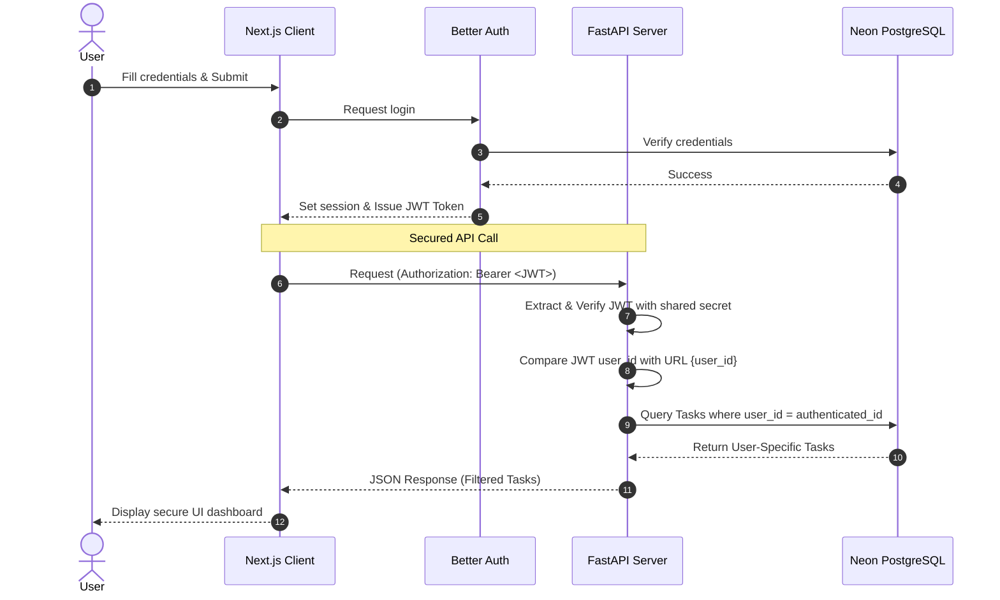

# System Specification: Authenticated & Secured Todo Web App (Phase II - Auth)

This specification defines the architectural and security requirements for integrating user authentication and multi-tenant task isolation into the decoupled full-stack Todo Web App.

---

## 1. Authentication Architecture

The system uses a decoupled authentication workflow powered by **Better Auth** (JS/TS frontend) and stateless **JWT token verification** (Python backend).



---

## 2. Frontend Specifications (Next.js & Better Auth)

### 2.1 Better Auth Configuration
- **Library:** Integrate Better Auth on the Next.js 16+ client.
- **JWT Plugin:** Enable the JWT plugin in the Better Auth configuration to automatically sign and issue stateless JSON Web Tokens upon session initialization.
- **Environment Variables:** Set the shared authentication secret in `frontend/.env.local`:
  ```env
  BETTER_AUTH_SECRET=your_extremely_secure_shared_secret_key
  ```

### 2.2 Client-Side API Client
- **Token Attachment:** The frontend HTTP/API client (`frontend/lib/api.ts` or custom fetch helper) must extract the active Better Auth JWT token and append it to the HTTP request headers:
  ```http
  Authorization: Bearer <JWT_TOKEN_HERE>
  ```
- **Redirection:** If the user is unauthenticated or the session expires, redirect them from secured dashboard routes to `/login`.

---

## 3. Backend Specifications (FastAPI)

### 3.1 Security Middleware & Dependency Injection
- **Shared Secret Verification:** The FastAPI backend must fetch the shared JWT signature secret from its environment variables (`src/backend/.env`):
  ```env
  BETTER_AUTH_SECRET=your_extremely_secure_shared_secret_key
  ```
- **Token Parsing:** Implement a dependency (`get_current_user` or similar JWT middleware) that:
  1. Extracts the token from the `Authorization: Bearer <token>` header.
  2. Decodes and verifies the signature using the shared `BETTER_AUTH_SECRET`.
  3. Rejects invalid, expired, or malformed tokens with a `401 Unauthorized` HTTP status code.

### 3.2 Task Ownership Enforcement
- On all `/api/{user_id}/...` endpoints, the backend must verify that the user ID decoded from the verified JWT payload matches the `{user_id}` path parameter.
- If a user tries to access or modify resources with a different `{user_id}` in the URL than their decoded JWT user ID, return `403 Forbidden`.

---

## 4. Relational Database Schema Updates (Neon DB)

Map authentication relationships into the relational Postgres schema:
- **`users` Table:** Automatically scaffolded and managed by Better Auth on the frontend database connector.
- **`tasks` Table Updates:**
  - Add `user_id` column (String/Text/UUID type depending on Better Auth's user ID schema).
  - Create a Foreign Key constraint linking `tasks.user_id` to `users.id` (on delete cascade).
  - Add a database index on `tasks.user_id` to optimize secure user filtering operations.

---

## 5. REST API Security Specifications

All task endpoints now require a valid JWT token in the request headers and filter operations by the authenticated user ID.

| Method | Endpoint | Authorization | Description |
| :--- | :--- | :--- | :--- |
| **GET** | `/api/{user_id}/tasks` | Bearer `<token>` | List all tasks belonging to the authenticated `{user_id}`. |
| **POST** | `/api/{user_id}/tasks` | Bearer `<token>` | Create a new task associated with `{user_id}`. |
| **GET** | `/api/{user_id}/tasks/{id}` | Bearer `<token>` | Get details of task `{id}` if owned by `{user_id}`. |
| **PUT** | `/api/{user_id}/tasks/{id}` | Bearer `<token>` | Update task `{id}` if owned by `{user_id}`. |
| **DELETE** | `/api/{user_id}/tasks/{id}` | Bearer `<token>` | Delete task `{id}` if owned by `{user_id}`. |
| **PATCH** | `/api/{user_id}/tasks/{id}/complete`| Bearer `<token>` | Toggle completion of task `{id}` if owned by `{user_id}`. |

---

## 6. Error Codes & Security Requirements

1. **401 Unauthorized:** Return when no `Authorization` header is provided, or the token signature is invalid/expired.
2. **403 Forbidden:** Return when the `{user_id}` specified in the request URL path does not match the decoded `user_id` in the verified JWT token.
3. **404 Not Found:** If a query requests a specific task ID `{id}` that exists but does not belong to the requesting `{user_id}`, the server should return `404 Not Found` (rather than `403`) to prevent leaking the existence of other users' tasks.
